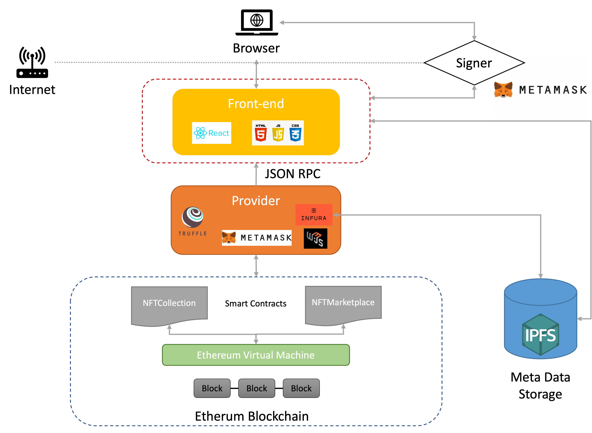

`#Ethereum`

# NFT Marketplace

This is an open decentralized NFT Marketplace built with smart contracts powered by Ethereum. It basically consists in an open platform where each user can mint his own NFT and expose it on a marketplace, see other users collections and buy the NFTs of their dreams.

## Table of Contents

- [Getting Started](#getting-started)
- [The Project](#the-project)
- [ Features of the NFT Marketplace](# Features of the NFT Marketplace)
- [Resources](#resources)


## Getting Started

These instructions will get you a copy of the project up and running on your local machine for development and testing purposes. Just follow the instructions below:

First, you will need to `clone` the repository into your Github account:

```
https://git.scc.kit.edu/uflgi/nft-marketplace/
```
<a id='technologies'/>


<a id='how-to-use'/>

## :joystick: How to Use

### Requirements

To run the application you'll need to install the following (_click links_):
* [Git](https://git-scm.com)
* [Python 3](https://www.python.org/downloads/)
* [Visual Studio 2022 with C++ Extension](https://visualstudio.microsoft.com/de/downloads/)
* [Node](https://nodejs.org/)
* [Truffle](https://trufflesuite.com/truffle/)
* Clone the repository:
  * ```$ git clone https://git.scc.kit.edu/uflgi/nft-marketplace.git ```


Now go to project folder and run:


```bash
$ cd nft-marketplace

# install the dependencies
$ npm install

# install truffle
$ npm install truffle -g

# deploy de contracts on the kovan testchain
$ truffle migrate --reset --network kovan

# start the application 
$ npm start
```

First of all, it is required to install Metamask wallet as a browser extension: https://metamask.io/

Then you should configure Metamask to connect to the Kovan testchain. This requires the following:
- Open Metamask
- Go to settings - advanced setting
- Scroll down and toggle the Button "show test networks" to on
- Open the Network Configuration panel
- Select the "Kovan Test Network"
- Get Free Kovan Ether on https://faucets.chain.link/


## The Project

This project consists in an open platform where each user can mint his own NFT and expose it on a marketplace by making an offer or buying NFT from others. It includes:

- A smart contract which represents a collection of NFTs by following the [ERC-721](https://ethereum.org/en/developers/docs/standards/tokens/erc-721/) standard
- A smart contract which represents the NFT Marketplace and contains all the logic to make offers, fill offers, the auction...
- Tests built with JavaScripts to ensure smart contracts are accomplishing the expected functionalities
- A React.js front-end application as a user interface


## Project architecture

## :gear: Built With

This project was developed with the following technologies:

#### **Frontend** <sub><sup>React + JavaScript</sup></sub>
  - [Node](https://nodejs.org/)
  - [React](https://pt-br.reactjs.org/)
  - [Web3.js](https://web3js.readthedocs.io/en/v1.3.4/)

#### **Backend** 
  - [IPFS](https://ipfs.io/)
 
#### **Blockchain and Smart Contracts** <sub><sup>Solidity</sup></sub>
  - [Solidity](https://docs.soliditylang.org/)
  - [Truffle](https://www.trufflesuite.com/)
  - [Kovan Testnet](https://kovan-testnet.github.io/website/)
  - [Infura](https://infura.io/)


<p>
  
</p></center>

The user can access the application via web-browser, and he must have the Metamask wallet installed. This interface, built with React.js, relies on the web3.js library to communicate with the smart contracts through Metamask. This means that the data reflected on the front-end application is fetched from the Ethereum blockchain. Each action performed by the user (mint a NFT, offer NFT, buy NFT...) creates a transaction on Ethereum, which will require Metamask confirmation and pay a small fee, and this transaction will permanently modify the state of the NFTCollection and NFTMarketplace smart contracts. On top of it, the user will upload the NFT Metadata to the IPFS, creating a permanent hash which will be permanently recorded on the blockchain itself to prove ownership.

<p>
  
</p></center>

<p>  
  
</p></center>

# Features of the NFT Marketplace

The user can perform the following actions on this NFT Marketplace:

#### Latest Drops

On the “home” page you do not only get introduced to the main features of our marketplace but can also admire the three most recently added NFTs, which means this section shows the three latest NFT mints made by any user of the platform.

#### Mint

The user must input a name, description and upload a file (image) to mint his own NFT. Once minted, a representation of this NFT will be displayed in the marketplace and initially it will be owned by its creator. This is open for everyone, meaning everyone can participate in this NFT creation within this collection. 

#### Make Offer

The user can offer his NFT by specifying its price (in Ether). If someone fulfils this offer, then the ownership is transferred to a new owner in exchange for the price paid. If the owner of the offered NFT would like to cancel the sale, he can simply cancel the offer and add the NFT back into his collection.

#### Offer NFT in an auction

The user can offer his NFT in an auction by specifying its price (in Ether). As soon as the NFT auction expires after a certain time, the NFT gets transferred to the highest bidding user in exchange for the bid (in ETH). If there is not a single bid for the offered NFT the user can “redeem NFT” to add the unsold NFT back the personal collection.

#### Cancel Offer

The user can cancel an offer he did in the past if in the end he does not want to sell his NFT or wants to adjust the price.

#### Buy

A user can buy those NFT which someone else offered. This will require paying the requested price (the Ether will be transferred to the smart contract to be claimed later on).

#### Claim Funds

If a user sold an NFT, he can claim his funds by clicking the "withdraw" button in the top-right corner.

#### See transaction history

The user can have a look at his transaction history by clicking on "transactions" in the top-right corner.

#### See user collection

If you click on the private key of an NFT owner, you can access his/her showroom and have a look at the users NFT collection. You can also have a look at your own collection (see “make offer”).

#### Resources


- Ethereum: [https://ethereum.org/en/]
- IPFS: [https://ipfs.io/] 
- ReactJS: [https://reactjs.org/] 
- Kovan Testnet: [https://kovan-testnet.github.io/website/]  
- Web3.js: [https://web3js.readthedocs.io/en/v1.7.3/] 
- Node.js: [https://nodejs.org/en/] 
- Metamask: [https://metamask.io/] 
- Infura: [https://infura.io/] 
- Solidity: [https://docs.soliditylang.org/en/v0.8.13/] 
- TruffleSuite: [https://trufflesuite.com/] 
- Cryptozombies: [https://cryptozombies.io/en/course] 


